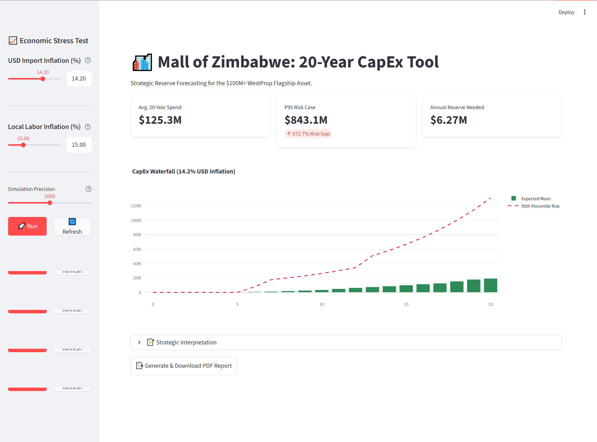
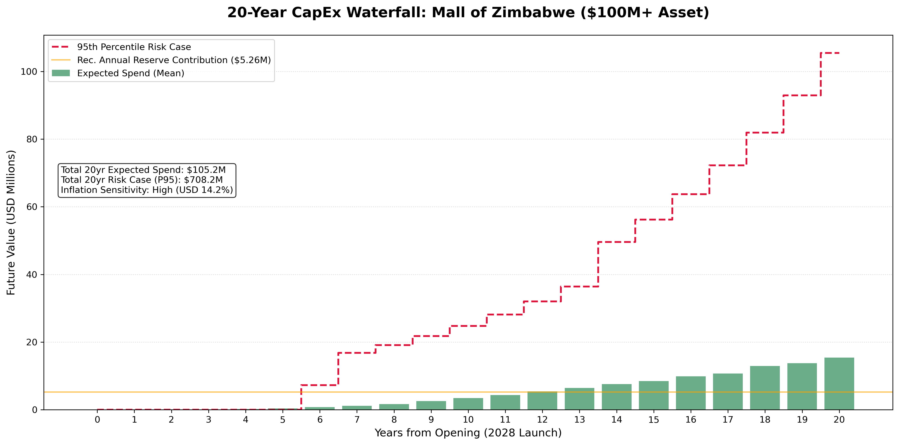
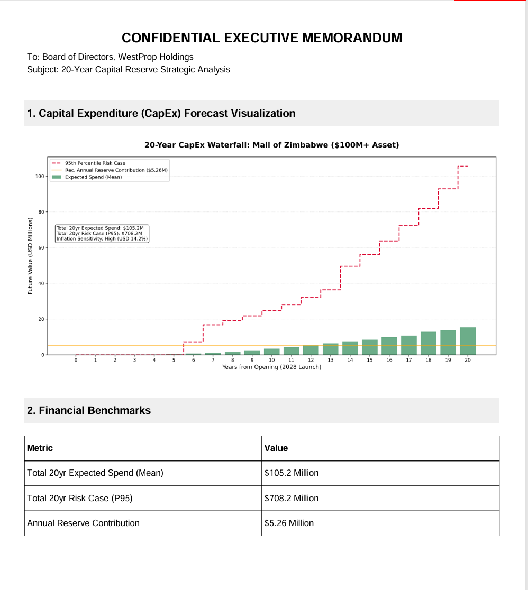
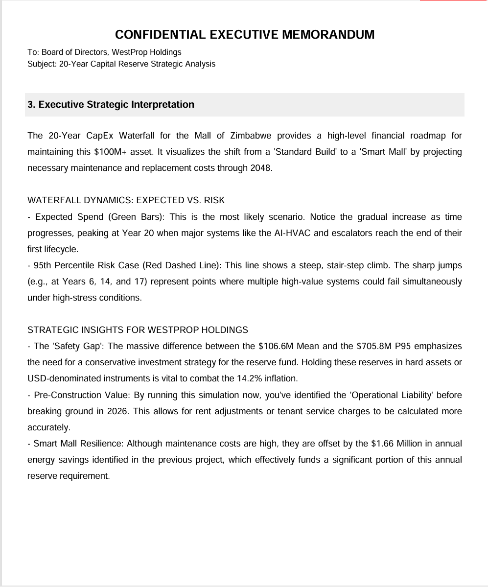

# 🏙️ Mall of Zimbabwe: 20-Year CapEx Reserve Model

**Strategic Financial Forecasting for a $100M+ Smart City Asset**



## 📋 Executive Summary
This project is a **Monte Carlo-based financial simulation engine** designed to forecast the 20-year capital expenditure (CapEx) requirements for the **Mall of Zimbabwe**, scheduled for launch in 2028.

Unlike static spreadsheets, this model accounts for:
* **Probabilistic Failure Rates:** Using Weibull distributions to simulate realistic component lifecycles (e.g., HVAC, Solar Microgrid).
* **Dual-Currency Inflation:** Modeling distinct inflation pathways for USD-pegged imports (14.2%) vs. Local Labor (10.0%).
* **Risk Analysis:** Calculating the **95th Percentile (P95)** risk case to ensure solvency during economic shocks.

## 📂 Project Structure
The repository is organized to separate data science logic, user interface code, and assets.

---

```text
MoZ-CapEx-Reserve-Model/
│
├── assets/                          # Visual assets for documentation
│   ├── dashboard_preview.png        # Main dashboard screenshot
│   ├── waterfall_chart.png          # CapEx Waterfall visualization
│   ├── report_page_1.png            # PDF Report Page 1
│   └── report_page_2.png            # PDF Report Page 2
│
├── .gitignore                       # Excludes venv, cache, and temp files
├── app.py                           # Main Streamlit Application (Simulation Engine + UI)
├── Untitled.ipynb                   # Jupyter Notebook for initial EDA & Algorithm testing
├── MoZ_Dynamic_Report.pdf  # Sample generated report
├── requirements.txt                 # Python dependencies
├── README.md                        # Project documentation
├── METHODOLOGY.md                   # Mathematical framework explanation
├── DOCUMENTATION.md                 # User guide
└── LICENSE                          # MIT License
```
---

## 🚀 Key Features
* **Interactive Dashboard:** A Streamlit interface allowing executives to stress-test inflation scenarios in real-time.
* **Automated Board Reporting:** One-click generation of a PDF "Confidential Executive Memorandum" containing dynamic charts and strategic interpretation.
* **Visual Waterfall Analysis:** Highlights the "Safety Gap" between expected maintenance costs and extreme risk scenarios.

---

## 📊 Visual Assets

### 1. The CapEx Waterfall
*Visualizes the accumulation of risk over 20 years, highlighting the "stair-step" jumps where major systems fail simultaneously.*


### 2. Automated Executive Reporting
*The system generates a boardroom-ready PDF that dynamically updates based on the user's simulation inputs.*

| **Page 1: Financial Benchmarks** | **Page 2: Strategic Interpretation** |
|:---:|:---:|
|  |  |

---

## 🛠️ Installation & Usage

1.  **Clone the Repository**
    ```bash
    git clone [https://github.com/stilhere4huniid/MoZ-CapEx-Reserve-Model.git](https://github.com/stilhere4huniid/MoZ-CapEx-Reserve-Model.git)
    cd MoZ-CapEx-Reserve-Model
    ```

2.  **Install Dependencies**
    ```bash
    pip install -r requirements.txt
    ```

3.  **Run the Dashboard**
    ```bash
    streamlit run app.py
    ```

---

## ⚠️ Disclaimer
**This is an independent Data Science portfolio project created strictly for educational and demonstration purposes.**

I am **not** affiliated with WestProp Holdings. All financial figures, rental assumptions, and construction estimates are hypothetical simulations used to demonstrate financial modeling capabilities. This tool does not constitute professional investment advice, and the creator assumes no liability for decisions made based on its outputs.

---

## 👨‍💻 Author

**Adonis Chiruka**
* *Data Science & Financial Modeling*
* 📧 **Email:** stillhere4hunnid@gmail.com
* 🔗 **LinkedIn:** [Adonis Chiruka](https://www.linkedin.com/in/adonis-chiruka-70b265323)
* 🐙 **GitHub:** [stilhere4huniid](https://github.com/stilhere4huniid)

---

## 📄 License
This project is licensed under the MIT License - see the [LICENSE](LICENSE) file for details.